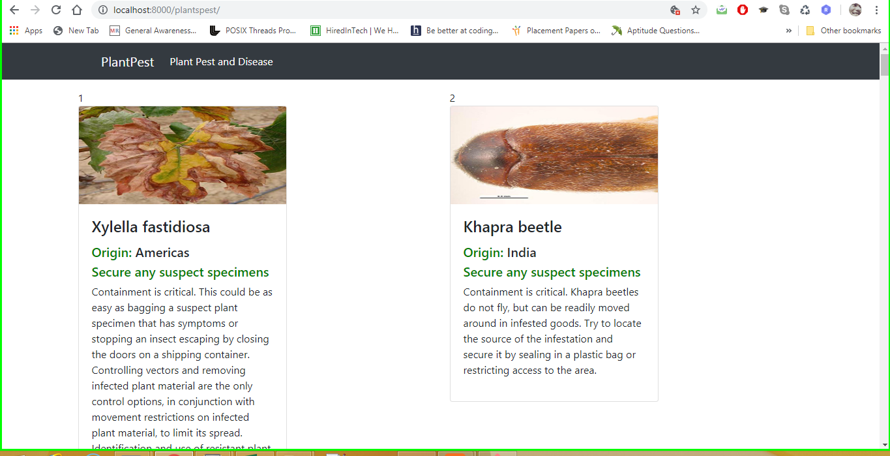
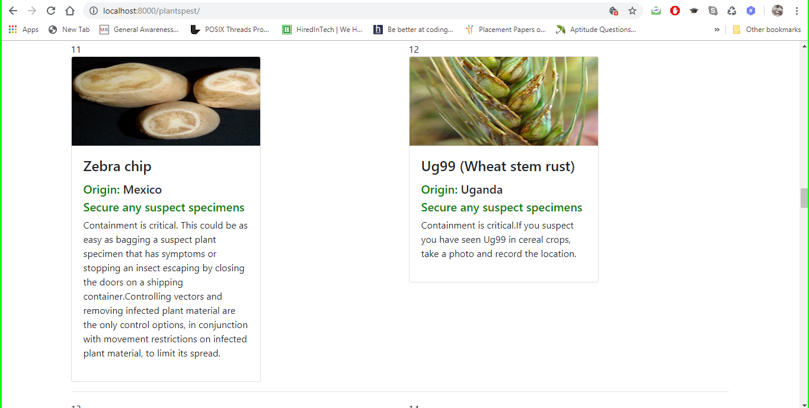
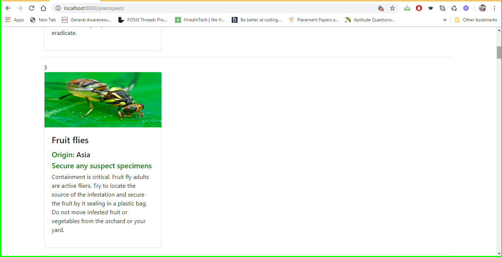
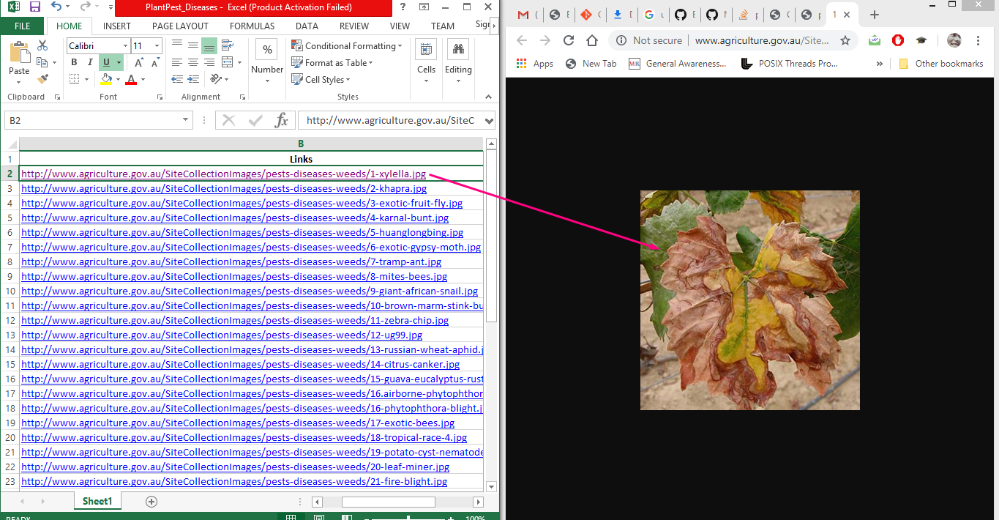
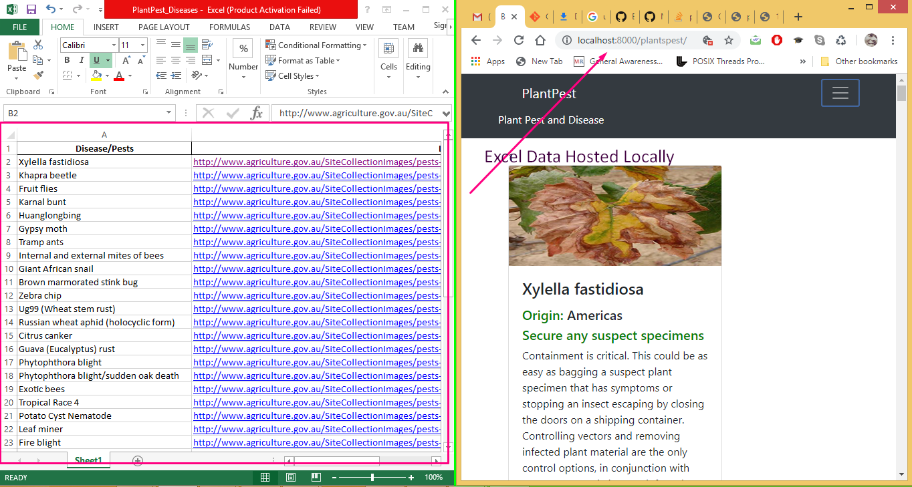

# WebAppPlants
Host data of excel to a webpage using **Django**

:star: **Star me on GitHub — it helps!**

### Table of content
- [Installation](#installation)
- [About Data](#About-Data)
- [Demo Screenshots](#Demo-Screenshots)
- [Excel Image Links](#Excel-Image-Links)
- [Excel Data Hosted Locally](#Excel-Data-Hosted-Locally)

## Installation

This Project would require 
   - Django Version 2.2.1
   - Pillow 
   - VirtualEnv 16.0.0

### About Data

The Excel data is scraped through http://agriculture.gov.au/pests-diseases-weeds/plant
via **BeautifulSoup** in Python

### Demo Screenshots

### Excel Image Links

### Excel Data Hosted Locally

